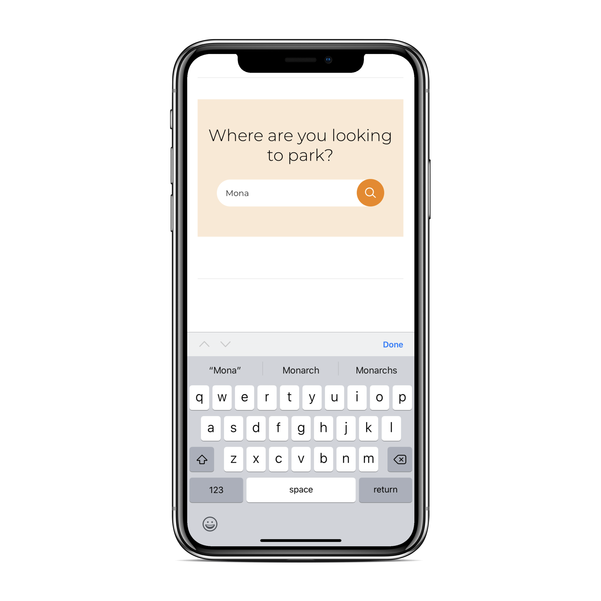

# HFX Parking UX Research
Parking has always been a challenging problem in North American regions as they are not tracked by a single entity. According to research, a motorist spends an average time of four days a year finding a parking spot. [1] To solve this problem, we have tried towards developing a prototype of a mobile application to mitigate the issues faced by Haligonians (people living in the HRM region). After researching the existing applications in the market, we have come up with three key features of a mobile application to help people with their parking needs. Further, we have conducted studies on those features where users will perform each task and we observed them. We then interviewed users to see what problems they are facing while using the application, and what new features they are looking forward to. This helped us design the initial design of our application followed by a low-fidelity prototype. The prototype was then rigorously assessed by doing a cognitive walkthrough study with a user persona (Abby). The results of this walkthrough will act as major feedback to our application design and will offer us recommendations to solve the issues in the low-fidelity prototype which will later furnish into a high-fidelity prototype that will be ready for user testing.

# High Fidelity Prototype

